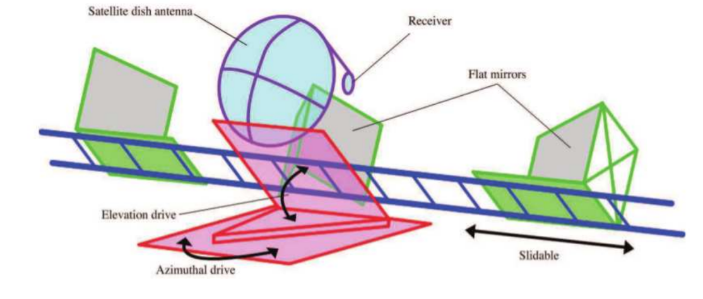

## radio interferometry to measure the angular diameter of sun

<br>

<p align="center">

</p>

<br>

* this project can be used to read data from ascii files produced by the experimental setup and then run the analysis (to `output/`) and its histograms (to `plots/`)

* run in ROOT with:

```
root -b -q DataRedux.C
root -b -q DataAna.C
```
